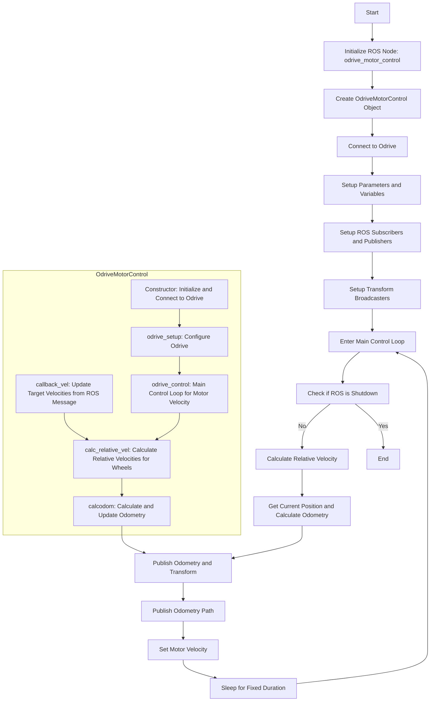

# odrive_motor_control
## python_programs

odrive_config.py       : Odrive for BLDC motor Automatic configuration.  
odrive_twist_driver.py : Odrive subscrive /cmd_vel, then calculate /odom and /odom_path  


## Environment
OS : Ubuntu 22.04   
ROS : humble

## FlowChart



# installing Modules
```
$ sudo apt update
$ sudo apt upgrade
$ sudo apt install python3 python3-pip 
$ sudo pip3 install --upgrade odrive
$ echo "PATH=$PATH:~/.local/bin/" >> ~/.bashrc 
$ sudo apt-get install ros-<ros_distro>-tf-transformations
```

# motor configuration
```
cd ~/ros2_ws/src/odrive_ros2_control/python_programs
sudo python3 odrive_config.py
```


# motor operation check(Keyboard)

## STEP1
```
lsusb
Bus 001 Device 009: ID 1209:0d32 Generic ODrive Robotics ODrive v3
```

```
ls -al /dev/bus//usb//001/009
crw-rw-r-- 1 root root 189, 8 5月 29 14:49 /dev/bus//usb//001/009
```

```
sudo chmod 666 /dev/bus/usb/001/009
```

## STEP2
```
cd ~/ros2_ws
source ~/ros2_ws/install/setup.bash
ros2 launch odrive_ros2_control odrive_keyboard_control.py
```

If all goes well, the following message will appear on the terminal
```
Connect to Odrive...
Connect to Odrive Success!!!
```

## rviz


